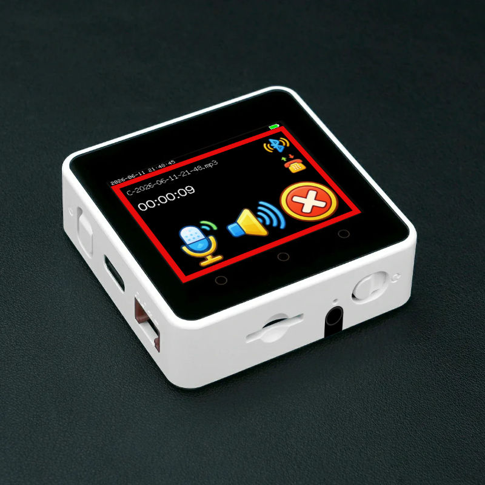
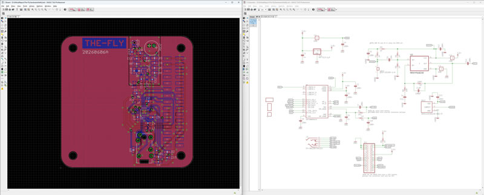
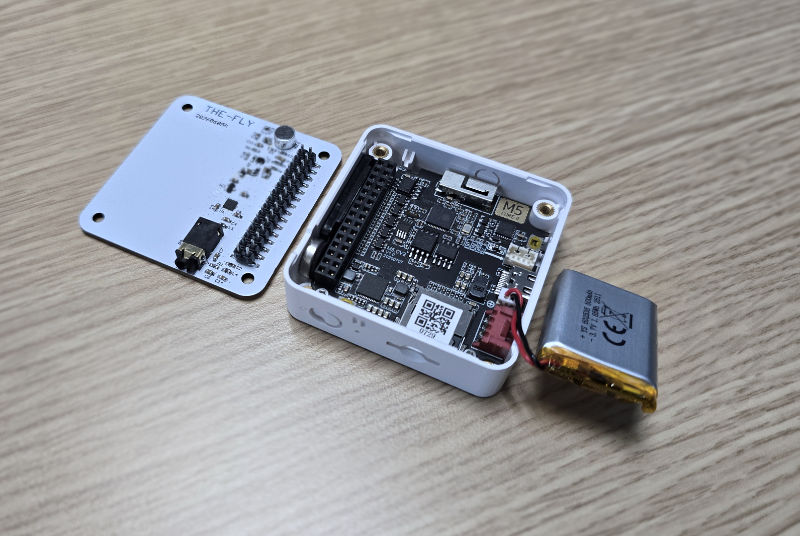

# The-Fly

This device is a Bluetooth meeting audio recording device. It can record meetings, phone calls, or voice memos. During the recording, the user can also use this device to participate in the meeting, as it features a speaker, a earphone jack, and internal microphone.

The audio recordings are stored on a microSD card.

It features Wi-Fi connectivity so that AI can be used to transcribe and summarize the audio recordings. A local network PC can run scripts that run local AI models that performs the transcription and summarization.

## User Manuals

 * [Main Device](user-docs/user-manual-main-device.md)
 * [Wi-Fi Operations](user-docs/user-manual-wifi-operations.md)
 * [Local Server](user-docs/user-manual-local-server.md)

## Technical Breakdown

The device is a [M5Stack Core2](https://docs.m5stack.com/en/core/core2). It features a ESP32-D0WDQ6-V3 as the main microcontroller. This microcontroller features Bluetooth Classic and Wi-Fi connectivity.

There is a colour LCD screen with a capacitive touch panel, used to implement the GUI. The GUI is structured for quick usage, with shortcuts to your favorite Bluetooth host devices and the ability to instantly start a memo recording.

The Fly connects to any Bluetooth host, such as a smartphone or a laptop, using the "hands free profile", meaning it pretends to be a early 2010s era earphone and microphone, which gives it nearly universal compatibility with all host devices and all host software. No need to install any dedicated software, and it is practically impossible to detect or block.

Wi-Fi operation is implemented so the user can download and transcribe the recorded audio files. The process can be automated to any level the user desires. All the software can be completely local and private.

To improve audio quality, I've also created a daughterboard for the M5Stack Core2 that uses a SGTL5000 codec and provides a earphone jack along with a better internal mic, plus it supports inline mics on the earbuds.

(note: the original internal speaker and internal mic of the M5Stack Core2 have terrible audio quality)
