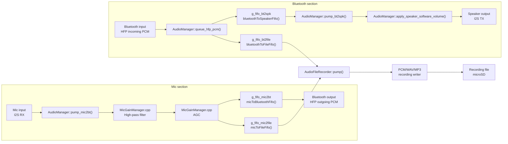
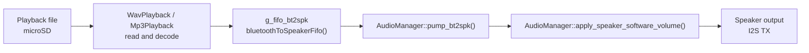

# Audio Pipeline

This is a generalized view of the runtime audio flow. It ignores the optional external codec detail and models the
hardware side as one microphone input, one speaker output, and one Bluetooth audio input.

## Recording

## Playback

