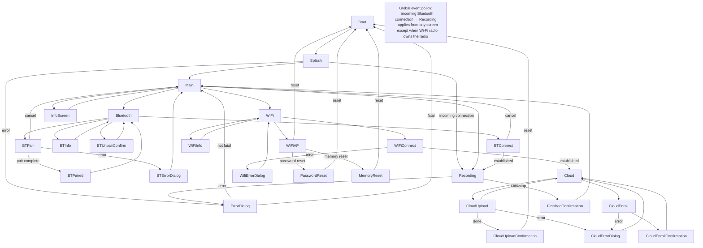

Things that the user needs to be able to do:

 * pair with Bluetooth host device
 * unpair Bluetooth
 * initiate Wi-Fi connection to access point
 * initiate Wi-Fi access point and wait for incoming connection
 * change volume during actual calls
 * mute or unmute mic

The top of the screen always shows the data and time, and the battery level. If the disk space is low, there will be a warning on the top bar.

The home screen shall have buttons for the actions the user might use the most often.

The screen while a recording is happening shall use a thick bright red border as a talley light.

The user can instantly start a memo recording, while the recording is happening, the user can switch the context between several memo-type, such recording as a reminder vs recording an idea.

