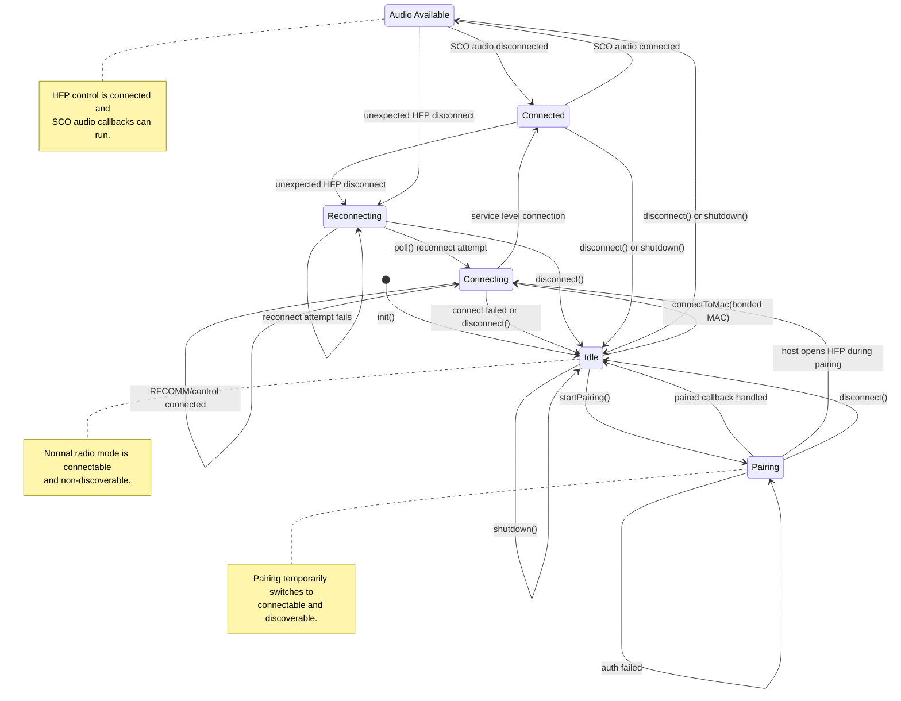

Handles bluetooth connections, including pairing

Namespace called `BtManager`

State machine:

- Idle
- Connecting
- Connected
- Audio Available
- Reconnecting
- Pairing

the bluetooth profile being implemented is only HFP

The audio callback functions are implemented in another module, but this module will be provided them as function pointers

Also include a callable function to issue a “pick up phone” command 

Public functions:

- Connect to MAC
- Start pairing
- Disconnect (also ends pairing or any connection attempts)
- Shutdown Bluetooth for Wi-Fi mode
- Get State

upon successful pairing, the caller is notified of the MAC and name of the paired device. This module does not handle any files that store such data.

The device normally stays connectable but not discoverable. Pairing mode temporarily makes it discoverable, then returns it to connectable/non-discoverable mode.

If attempting to connect to a device that we are not bonded with, return an error code

### State Diagram

Diagram generated June 2 2026

