# Device Overview

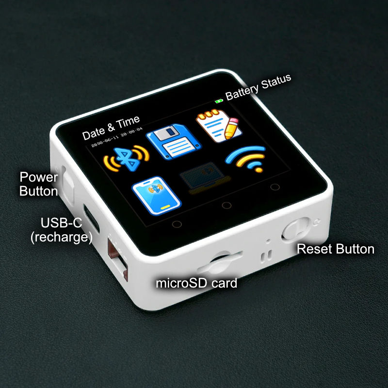

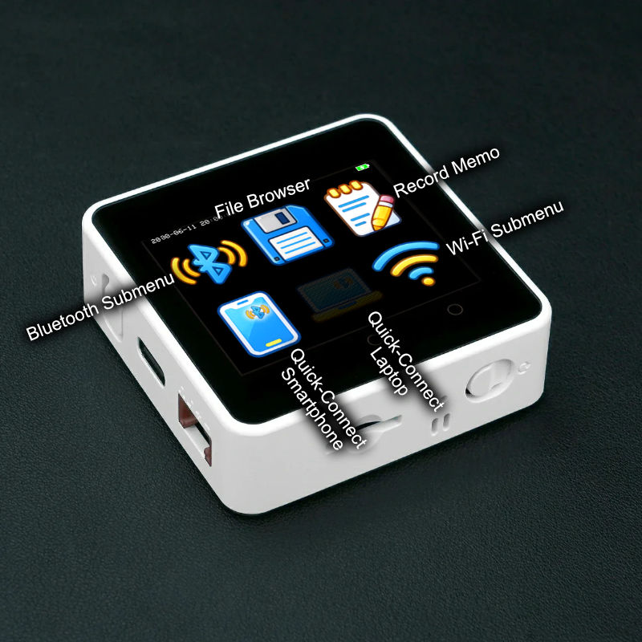

To turn on The Fly, press the power button. To turn it off, hold the power button until it powers off.

The USB-C port only works for recharging the battery, it does not offer USB storage or file access.

The microSD card should be large (64GB recommended) and formatted to the FAT32 filesystem.

# Pairing a Device

From the Home screen, tap the Bluetooth button to enter the BT submenu, then scroll to the Pairing button and click it.

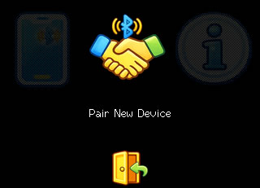

From your smartphone or laptop, also initiate pairing. The device name should be similar to "The Fly ABCD".

The two devices should pair successfully. There will be a confirmation dialog displayed. You can dismiss it, The Fly will reboot after this.

## Assigning a BT Host Device to Home Screen

You can use the Wi-Fi web configuration interface to assign an icon to any of the paired Bluetooth host devices. If you assign the smartphone or laptop icon to a Bluetooth host device, it will be promoted to being a quick access button on the Home screen.

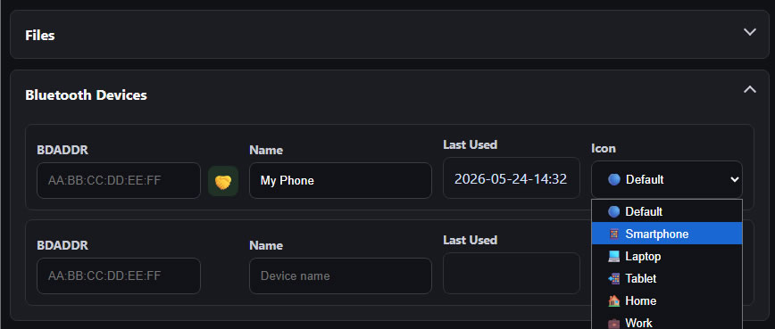

## Deleting a Paired BT Host Device

From the Home screen, tap the Bluetooth button to enter the BT submenu, then scroll to the BT host device you want to delete.

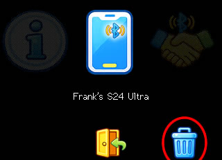

Then press-and-hold the button representing the device you want to delete. Once you have held the button long enough, a delete button will appear on the bottom right corner of the screen. Click on this delete button to unpair and delete the BT host device.

# Starting a Bluetooth Recording

To start a Bluetooth recording, simply initiate a connection to your Bluetooth host device, the recording will automatically start as soon as the connection is established. You can do this from the home screen or from the Bluetooth submenu by scrolling to the correct BT host device and then clicking on it.

Or, from your Bluetooth host, initiate a connection to The Fly, the recording will automatically start as soon as the connection is established.

## Options During Recording

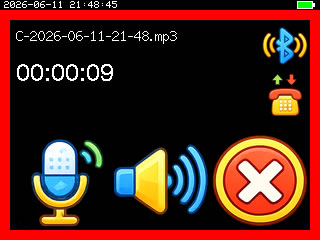

During a recording, there are 3 buttons on the bottom of the screen. The two with mic and speaker icons allows you to mute the mic or speaker/earbud. The stop button on the right ends the recording and disconnects the Bluetooth connection.

The volume level of the speaker/earbud is controlled through the volume controls of your Bluetooth host, so the volume button on your smartphone or on your laptop.

The recording file is capturing all sound whether or not the speaker/earbud is muted. You may leave the speaker/earbud muted forever if you are taking the meeting from a meeting room, as an example situation.

There is a display for detected actual sound level so you can have the device muted completely and still know if somebody is talking.

There is another button to "pick up call" but that only does anything if there's an incoming call that is currently ringing.

# Starting a Memo Recording

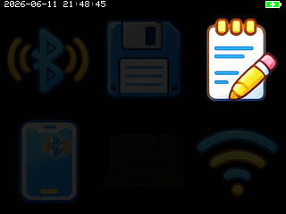

Clicking the notebook button from the Home screen will start a memo recording. Simply speak into the microphone to record your thoughts.

There is a stop button in the bottom right corner of the screen that will stop the recording.

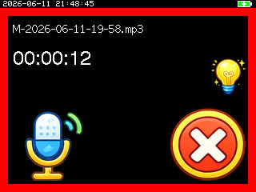

In the right side of the screen, there is an icon indicating the type of memo you are recording. You may click on it to cycle through the options. There are option provided for "reminder", or "idea", the selection will be reflected in the final saved file name of the recorded sound file.

# Playing Back a Recording

From the Home screen, the top center button will let you browse through your latest recorded sound files.

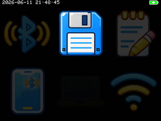

Scroll through the files and then click on the one you want to play back.

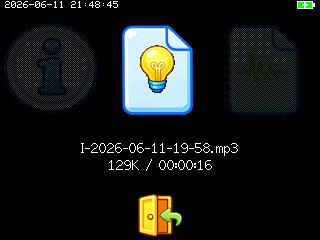

When clicked, you will enter the playback screen and the sound will start playing.

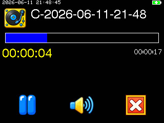

There is a play/pause button, a volume control button, and a stop button on the bottom of the screen.

When the sound is paused, a delete button will appear in the top right corner of the screen. Clicking it once will ask you to confirm the deletion of the current file, and clicking it a second time will cause the confirm and complete the deletion.

The time bar can be tapped or dragged to navigate through the recording. When paused, a second more high precision scrub bar is presented so you may navigate to the correct time on very long recordings.

# Wi-Fi Operations

The Fly has features involving Wi-Fi

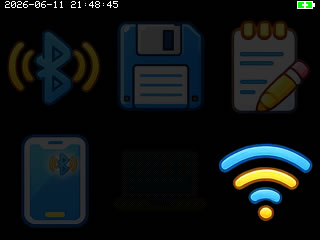

It has two main Wi-Fi connection modes: connect to Wi-Fi router, and act as an access point

Over Wi-Fi, you can do:

 * download files (also upload and delete files)
 * edit remembered Wi-Fi connections
 * edit remembered Bluetooth devices
 * sync the clock
 * change password or pin (if using a security enabled firmware)
 * reset memory

For more instructions, see [the User Manual about Wi-Fi Operations](user-manual-wifi-operations.md)
