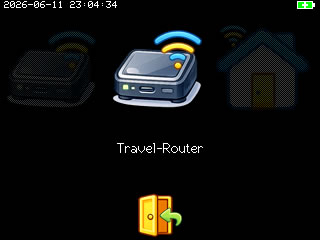
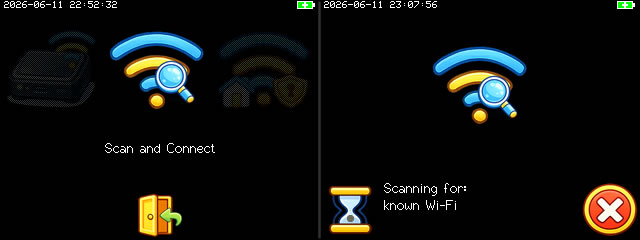
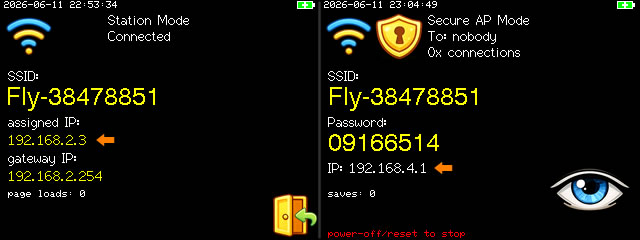
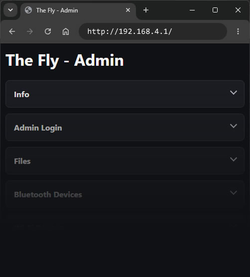
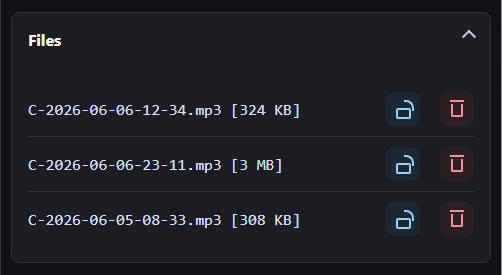
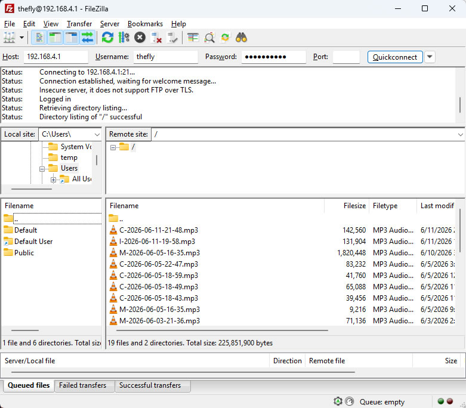

## Starting Wi-Fi Operations

From the Home screen, click on the Wi-Fi button, and you will enter the Wi-Fi submenu.

From the Wi-Fi submenu, you can scroll through all of your configured Wi-Fi routers or access points. Scroll to the one you want to use and click on it to activate.

## Automatic Scan and Connect

There is also an option to scan for available Wi-Fi routers in the area and automatically connect to one that you have provided the credentials for.

## Connecting to the Web Interface

Once activated, you will be presented with a screen with details about the Wi-Fi connection. 

Use the IP information shown here from your web browser to access the web interface.

## Downloading Recording Files

On the web page interface, there is a section for file downloads:

Simply click on a file to download it, or click on the trash icon beside it to delete it.

Another way is to use a FTP client. You can use plain FTP (not SFTP) to connect to The Fly by its IP (port is 22). The username and password are both "thefly".

## Administration

