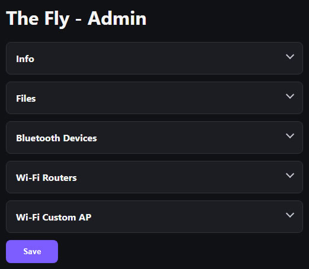
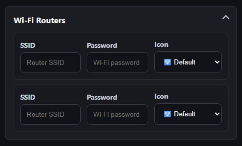
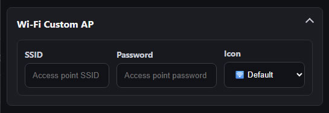
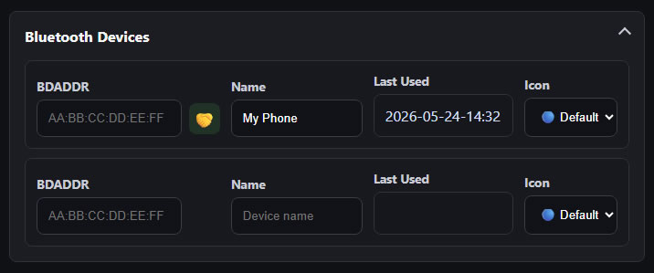
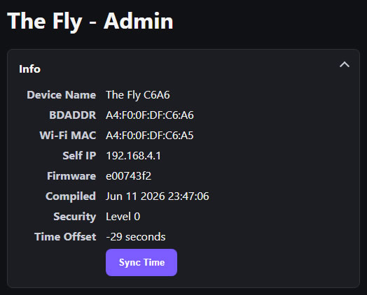
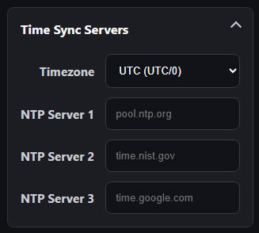

## Starting Wi-Fi Operations

From the Home screen, click on the Wi-Fi button, and you will enter the Wi-Fi submenu.

From the Wi-Fi submenu, you can scroll through all of your configured Wi-Fi routers or access points. Scroll to the one you want to use and click on it to activate.

## Automatic Scan and Connect

There is also an option to scan for available Wi-Fi routers in the area and automatically connect to one that you have provided the credentials for.

## Connecting to the Web Interface

Once activated, you will be presented with a screen with details about the Wi-Fi connection. 

Use the IP information shown here from your web browser to access the web interface.

## Downloading Recording Files

On the web page interface, there is a section for file downloads:

Simply click on a file to download it, or click on the trash icon beside it to delete it.

Another way is to use a FTP client. You can use plain FTP (not SFTP) to connect to The Fly by its IP (port is 22). The username and password are both "thefly".

## Administration

You can change a lot of settings and configuration. When you are done, make sure you click on the "save" button. The changes will take effect when you reboot The Fly.

### Administration: Wi-Fi Routers

You may set up some Wi-Fi routers to connect to.

These will show up in the Wi-Fi submenu. These can also be scanned for and automatically connected to.

### Administration: Wi-Fi Access Point

You can set The Fly to become a Wi-Fi access point that your computer connects to.

This can be useful if you need an automated workflow that requires The Fly to be isolated from your own networks.

NOTE: in addition to your custom AP, there is always a dedicated default access point configuration that you can use, but it is randomly generated.

### Administration: Bluetooth Host Devices

You may rename Bluetooth host devices and assign icons to them.

### Administration: Sync Time

If the clock is wrong, click on the "Sync Time" button.

Also, there is an explicit setting for the timezone under the NTP time sync section

You can specify custom NTP servers but this is optional. They are not used unless you explicitly trigger a NTP time sync through the Wi-Fi submenu.
